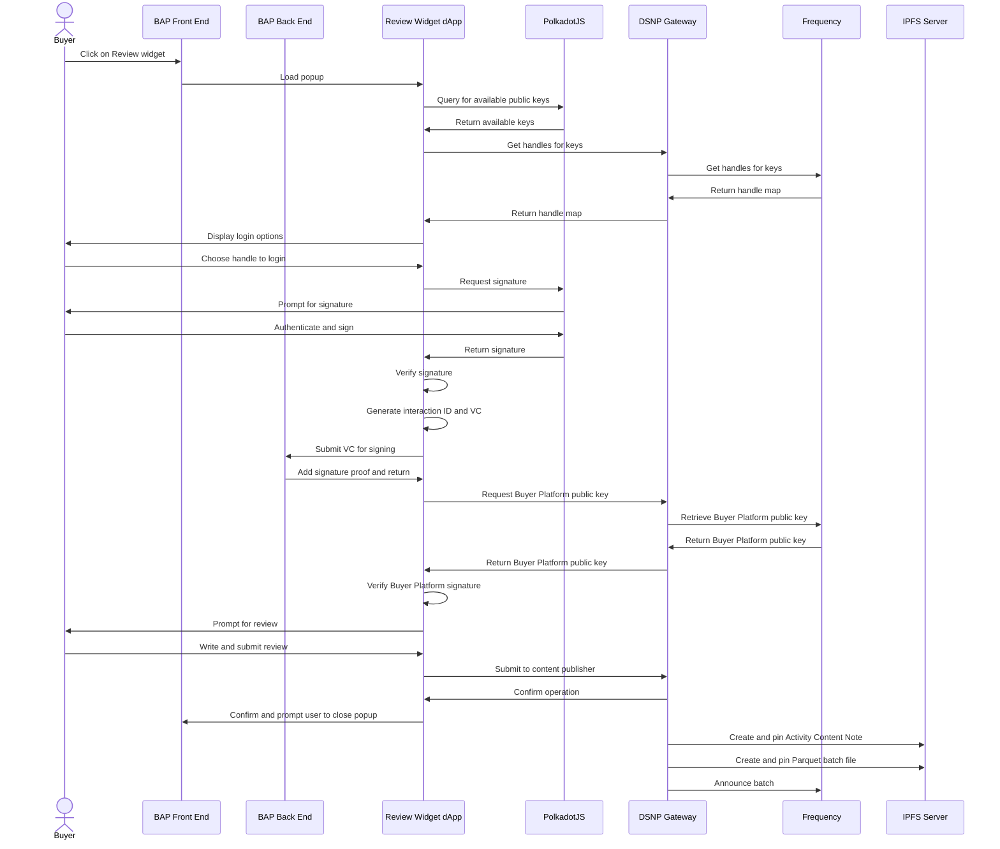

***Interaction Diagram: Buyer Reviews Item***

```mermaid
sequenceDiagram
    actor B as Buyer
    participant BAPF as BAP Front End
    participant BAPB as BAP Back End
    participant RWD as Review Widget dApp
    participant PJS as PolkadotJS
    participant GW as DSNP Gateway
    participant FRQCY as Frequency
    participant IPFS as IPFS Server
    B->>BAPF: Click on Review widget
    BAPF->>RWD: Load popup
    RWD->>PJS: Query for available public keys
    PJS->>RWD: Return available keys
    RWD->>GW: Get handles for keys
    GW->>FRQCY: Get handles for keys
    FRQCY->>GW: Return handle map
    GW->>RWD: Return handle map
    RWD->>B: Display login options
    B->>RWD: Choose handle to login
    RWD->>PJS: Request signature
    PJS->>B: Prompt for signature
    B->>PJS: Authenticate and sign
    PJS->>RWD: Return signature
    RWD->>RWD: Verify signature
    RWD->>RWD: Generate interaction ID and VC
    RWD->>BAPB: Submit VC for signing
    BAPB->>RWD: Add signature proof and return
    RWD->>GW: Request Buyer Platform public key
    GW->>FRQCY: Retrieve Buyer Platform public key
    FRQCY->>GW: Return Buyer Platform public key
    GW->>RWD: Return Buyer Platform public key
    RWD->>RWD: Verify Buyer Platform signature
    RWD->>B: Prompt for review
    B->>RWD: Write and submit review
    RWD->>GW: Submit to content publisher
    GW->>RWD: Confirm operation
    RWD->>BAPF: Confirm and prompt user to close popup
    GW->>IPFS: Create and pin Activity Content Note
    GW->>IPFS: Create and pin Parquet batch file
    GW->>FRQCY: Announce batch
```
